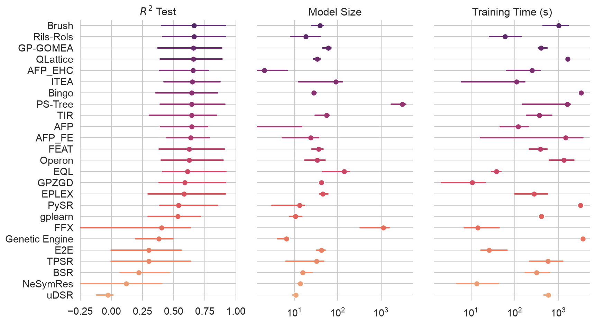
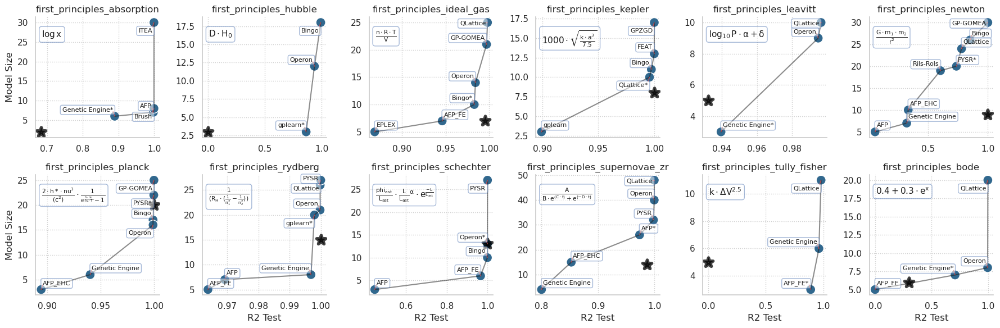

# SRBench: A Living Benchmark for Symbolic Regression

-----

The methods for symbolic regression (SR) have come a long way since the days of Koza-style genetic programming (GP).

Our goal with this project is to keep a living benchmark of modern symbolic regression, in the context of state-of-the-art ML methods.

Currently these are the challenges, as we see it:

- Lack of cross-pollination between the GP community and the ML community (different conferences, journals, societies etc)
- Lack of strong benchmarks in SR literature (small problems, toy datasets, weak comparator methods)
- Lack of a unified framework for SR, or GP

We are addressing the lack of pollination by making these comparisons open source, reproduceable and public, and hoping to share them widely with the entire ML research community.
We are trying to address the lack of strong benchmarks by providing open source benchmarking of many SR methods on large sets of problems, with strong baselines for comparison. 
To handle the lack of a unified framework, we've specified minimal requirements for contributing a method to this benchmark: a scikit-learn compatible API.

# Benchmarked Methods

The current edition of the benchmark (SRBench 2025, reported in our [_call for action_ paper](#call-for-action)) evaluates **25** symbolic regression methods under a unified experimental setup: every method runs from a docker container, with hyperparameter tuning and **30** independent runs per dataset, on **24** datasets from [PMLB](https://github.com/EpistasisLab/penn-ml-benchmarks) plus a set of first-principles regression problems.
This roster includes the 14 methods from the original SRBench together with the methods staged since then.

Methods currently benchmarked:

| Method |  |  |
|:--|:--|:--|
| **AFP** - [paper](http://dx.doi.org/10.1007/978-1-4419-7747-2_8) | **AFP_fe** | **AFP_ehc** - [paper](https://www.sciencedirect.com/science/article/abs/pii/S0952197616301294) |
| **Bingo** - [paper](https://dl.acm.org/doi/10.1145/3520304.3534031) | **Brush** - [paper](https://royalsocietypublishing.org/rsta/article/384/2317/20240588/481208/Towards-symbolic-regression-for-interpretable) | **BSR** - [paper](https://arxiv.org/abs/1910.08892) |
| **E2E** - [paper](https://papers.neurips.cc/paper_files/paper/2022/file/42eb37cdbefd7abae0835f4b67548c39-Paper-Conference.pdf) | **EPLEX** - [paper](https://direct.mit.edu/evco/article-pdf/27/3/377/1858632/evco_a_00224.pdf) | **EQL** - [paper](http://proceedings.mlr.press/v80/sahoo18a/sahoo18a.pdf) |
| **FEAT** - [paper](https://openreview.net/pdf?id=Hke-JhA9Y7) | **FFX** - [paper](https://link.springer.com/chapter/10.1007/978-1-4614-1770-5_13) | **Genetic Engine** - [paper](https://dl.acm.org/doi/10.1145/3564719.3568697) |
| **GPGomea** - [paper](http://dx.doi.org/10.1162/evco_a_00278) | **GPlearn** - [paper]() | **GPZGD** - [paper](https://doi.org/10.1145/3377930.3390237) |
| **ITEA** - [paper](https://direct.mit.edu/evco/article-pdf/29/3/367/1959462/evco_a_00285.pdf) | **NeSymRes** - [paper](http://proceedings.mlr.press/v139/biggio21a/biggio21a.pdf) | **Operon** - [paper](https://link.springer.com/article/10.1007/s10710-019-09371-3) |
| **Ps-Tree** - [paper](https://www.sciencedirect.com/science/article/pii/S2210650222000335) | **PySR** - [paper](https://arxiv.org/abs/2305.01582) | **Qlattice** - [paper](https://arxiv.org/abs/2104.05417) |
| **Rils-rols** - [paper](http://dx.doi.org/10.1186/s40537-023-00743-2) | **TIR** - [paper](https://doi.org/10.1145/3597312) | **TPSR** - [paper](https://openreview.net/forum?id=0rVXQEeFEL) |
| **uDSR** - [paper](https://proceedings.neurips.cc/paper_files/paper/2022/file/dbca58f35bddc6e4003b2dd80e42f838-Paper-Conference.pdf) |  |  |

The full experiment code and results for this edition live on the [`srbench_2025`](https://github.com/cavalab/srbench/tree/srbench_2025) branch (raw results in [`results/`](https://github.com/cavalab/srbench/tree/srbench_2025/results)).
If you are choosing baselines for a new symbolic regression paper, please use this roster and these results rather than the 2021 tables below.

Black-box regression (median and 95% confidence interval across datasets):



First-principles problems (accuracy-size Pareto fronts; the star marks the known first-principles expression evaluated on the same data):



## SRBench v2.0 (2021)

The original published edition of the benchmark ([NeurIPS 2021](#v20)) consists of **14** symbolic regression methods, **7** other ML methods, and **252** datasets from [PMLB](https://github.com/EpistasisLab/penn-ml-benchmarks), including real-world and synthetic datasets from processes with and without ground-truth models.
The results pages on the [project website](https://cavalab.org/srbench/) currently correspond to this edition; its raw results are the `feather` files in [`results/`](./results/) on this branch.

Methods benchmarked in v2.0:

- Age-Fitness Pareto Optimization (Schmidt and Lipson 2009) 
    [paper](https://dl.acm.org/doi/pdf/10.1145/1830483.1830584)
    , 
    [code](https://github.com/cavalab/ellyn)
- Age-Fitness Pareto Optimization with Co-evolved Fitness Predictors (Schmidt and Lipson 2009) 
    [paper](https://dl.acm.org/doi/pdf/10.1145/1830483.1830584?casa_token=8fAFUrPlfuUAAAAA:u0QJvX-cC8rPtdZri-Jd4ZxcnRSIF_Fu2Vn5n-oXVNu_i71J6ZECx28ucLPOLQY628drsEbg4aFvTw)
    , 
    [code](https://github.com/cavalab/ellyn)
- AIFeynman 2.0 (Udrescu et al. 2020)
    [paper](https://arxiv.org/abs/2006.10782)
    ,
    [code](https://github.com/SJ001/AI-Feynman)
- Bayesian Symbolic Regression (Jin et al. 2020)
    [paper](https://arxiv.org/abs/1910.08892)
    ,
    [code](https://github.com/ying531/MCMC-SymReg)
- Deep Symbolic Regression (Petersen et al. 2020)
    [paper](https://arxiv.org/pdf/1912.04871)
    , 
    [code](https://github.com/brendenpetersen/deep-symbolic-optimization)
- Fast Function Extraction (McConaghy 2011)
    [paper](http://trent.st/content/2011-GPTP-FFX-paper.pdf)
    ,
    [code](https://github.com/natekupp/ffx)
- Feature Engineering Automation Tool (La Cava et al. 2017)
    [paper](https://arxiv.org/abs/1807.00981)
    ,
    [code](https://github.com/lacava/feat)
- epsilon-Lexicase Selection (La Cava et al. 2016)
    [paper](https://arxiv.org/abs/1905.13266)
    ,
    [code](https://github.com/cavalab/ellyn)
- GP-based Gene-pool Optimal Mixing Evolutionary Algorithm (Virgolin et al. 2017)
    [paper](https://dl.acm.org/doi/pdf/10.1145/3071178.3071287?casa_token=CHa8EK_ic5gAAAAA:mOAOCu6CL-jHobGWKD2wco4NbpCyS-XTY5thb1dPPsyUkTkLHzmLMF41MWMGWLyFv1G8n-VFaqmXSw)
    ,
    [code](https://github.com/marcovirgolin/GP-GOMEA/)
- gplearn (Stephens)
    [code](https://github.com/trevorstephens/gplearn)
- Interaction-Transformation Evolutionary Algorithm (de Franca and Aldeia, 2020)
    [paper](https://www.mitpressjournals.org/doi/abs/10.1162/evco_a_00285)
    ,
    [code](https://github.com/folivetti/ITEA/)
- Multiple Regression GP (Arnaldo et al. 2014)
    [paper](https://dl.acm.org/doi/pdf/10.1145/2576768.2598291?casa_token=Oh2e7jDBgl0AAAAA:YmYJhFniOrU0yIhsqrHGzUN_60veH56tfwizre94uImDpYyp9RcadUyv_VZf8gH7v3uo5SxjjIPPUA)
    ,
    [code](https://github.com/flexgp/gp-learners)
- Operon (Burlacu et al. 2020)
    [paper](https://dl.acm.org/doi/pdf/10.1145/3377929.3398099?casa_token=HJgFp342K0sAAAAA:3Xbelm-5YjcIgjMvqLcyoTYdB0wNR0S4bYcQBGUiwOuwqbFfV6YnE8YKGINija_V6wCi6dahvQ3Pxg)
    ,
    [code](https://github.com/heal-research/operon)

- Semantic Backpropagation GP (Virgolin et al. 2019)
    [paper](https://dl.acm.org/doi/pdf/10.1145/3321707.3321758?casa_token=v43VobsGalkAAAAA:Vj8S9mHAv-H4tLm_GCL4DJdfW3e5SVUtD6J3gIQh0vrNzM3s6psjl-bwO2NMnxLN0thRJ561OZ0sQA)
    ,
    [code](https://github.com/marcovirgolin/GP-GOMEA)

# Contribute

We are actively updating and expanding this benchmark. 
Want to add your method? 
See our [Contribution Guide.](https://cavalab.org/srbench/contributing/)

## Benchmark results

We made available all of our experiments' results as `feather` files: the 2021 (v2.0) results inside [`/results/`](./results/) on this branch, and the 2025 results inside [`/results/`](https://github.com/cavalab/srbench/tree/srbench_2025/results) on the [`srbench_2025`](https://github.com/cavalab/srbench/tree/srbench_2025) branch.

## Contributing and running it locally

Check out [`CONTRIBUTING.md`](./CONTRIBUTING.md) file to see how to set up your algorithm. This guide will detail all the requirements in order to submit a pull request with a compatible interface with SRBench.

The `analyze` file is the main entry point as it will parse the flags and create specific python commands to run each experiment independently. Some examples on how to invoke the experiments are available at the [`docs/user_guide.md`](./docs/user_guide.md).

## Reproducing the experiments

**Note on Git LFS:** This repository uses [Git Large File Storage (LFS)](https://git-lfs.com/) for storing large dataset files. GitHub provides sufficient free bandwidth and storage per month [for GitHub Free accounts](https://docs.github.com/en/billing/concepts/product-billing/git-lfs); additional bandwidth requires a paid plan. If you have a [GitHub Student account](https://education.github.com), you may see larger capacities. If you don't need the actual results files, you can clone without LFS using:

```bash
GIT_LFS_SKIP_SMUDGE=1 git clone https://github.com/cavalab/srbench.git
```

A detailed guide on how to reproduce the experiments by yourself is provided in [`docs/user_guide.md`](./docs/user_guide.md).

Once you get all the results, you nee to collate the results using the `collate` scripts in [`./postprocessing/scripts`](./postprocessing/scripts/collate_experiments_results.py)

# References

## [Call for action](https://github.com/cavalab/srbench/tree/srbench_2025)

The current (2025) edition of the benchmark, including all $25$ available methods, was reported in our GECCO 2025 SR workshop paper:

> Imai Aldeia, G. S., Zhang, H., Bomarito, G., Cranmer, M., Fonseca, A., Burlacu, B., La Cava, W., and de França, F. 2025. 
> Call for Action: towards the next generation of symbolic regression benchmark. 
> _Proceedings of the Genetic and Evolutionary Computation Conference Companion_
> 
> [doi](https://dl.acm.org/doi/10.1145/3712255.3734309),
> [preprint](https://arxiv.org/abs/2505.03977)

## [v2.0](https://github.com/EpistasisLab/regression-benchmark/releases/tag/v2.0)

[v2.0](https://github.com/EpistasisLab/regression-benchmark/releases/tag/v2.0) of the benchmark was reported in our Neurips 2021 paper: 

> La Cava, W., Orzechowski, P., Burlacu, B., de França, F. O., Virgolin, M., Jin, Y., Kommenda, M., & Moore, J. H. (2021). 
> Contemporary Symbolic Regression Methods and their Relative Performance. 
_Neurips Track on Datasets and Benchmarks._
> 
> [arXiv](https://arxiv.org/abs/2107.14351),
> [neurips.cc](https://datasets-benchmarks-proceedings.neurips.cc/paper/2021/hash/c0c7c76d30bd3dcaefc96f40275bdc0a-Abstract-round1.html)

## [v1.0](https://github.com/EpistasisLab/regression-benchmark/releases/tag/v1.0) 

v1.0 was reported in our GECCO 2018 paper: 

> Orzechowski, P., La Cava, W., & Moore, J. H. (2018). 
> Where are we now? A large benchmark study of recent symbolic regression methods. 
> GECCO 2018.
>
> [DOI](https://doi.org/10.1145/3205455.3205539),
> [Preprint](https://www.researchgate.net/profile/Patryk_Orzechowski/publication/324769381_Where_are_we_now_A_large_benchmark_study_of_recent_symbolic_regression_methods/links/5ae779b70f7e9b837d392dc9/Where-are-we-now-A-large-benchmark-study-of-recent-symbolic-regression-methods.pdf)


# Contact

William La Cava ([@lacava](https://github.com/lacava)), william dot lacava at childrens dot harvard dot edu

