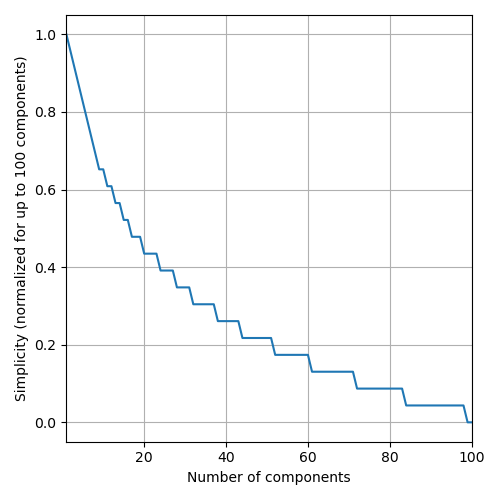

  <h1>2022 SRBench Competition</h1>
  
This competition is now closed.

---
# Judging Criteria

The judging criteria differ between the two tracks of the competition, *Synthetic* and *Real-World*. 
Before competing in any of the two, a method needs to pass a common qualification stage. 
The qualification stage is aimed at filtering out poorly-performing methods.

## Qualification Stage

For a method to qualify for the competition, it needs to obtain a better Test [R2 Score](https://scikit-learn.org/stable/modules/generated/sklearn.metrics.r2_score.html?highlight=r2_score#sklearn.metrics.r2_score) than the linear method [LinearRegression](https://scikit-learn.org/stable/modules/generated/sklearn.linear_model.LinearRegression.html) on (a subset of) PMLB-20 (as a reference, see the results of *Linear* [here](https://github.com/cavalab/srbench/blob/master/postprocessing/blackbox_results.ipynb)).
This will be tested by the organizers of the competition. 
However, participants are encouraged to assess that their method beats LinearRegression to ensure that the method will pass the qualification stage and stand a chance of being competitive.

## Judging Criteria for the *Synthetic* Track

The following (measurable and objective) aspects are considered to evaluate the quality of an SR method:

* `accuracy`: The produced SR models should be accurate. Accuracy is measured in terms of the [R2 Score](https://scikit-learn.org/stable/modules/generated/sklearn.metrics.r2_score.html?highlight=r2_score#sklearn.metrics.r2_score) measured on the test set.
To account for the fact that methods achieving similar R2 Scores can be considered equivalently good, the R2 Score is rounded to the 3rd decimal (e.g., 0.8712 -> 0.871).
* `simplicity`: SR models should be simpler in order to stand a higher chance of being interpretable. As a loose metric for this, the number of components of the model (post simplification via `sympy`) is considered as measure of complexity, i.e., the opposite of simplicity. 
We consider finding an accurate but less complex model to become increasingly hard with decreasing levels of complexity.
Thefefore, complexity is actually calculated as a function of `round(-log_5(s), 1)`, where `s` is the number of components in the (`sympy`-simplified) model. This translates to the figure below, such that, e.g., a model with 4 components is considered to be better than one with 5 components, while a model with 85 components is considered to be the same of one with 90 components.

* `property`: Each synthetic data set is prepared with respect to a certain property (e.g., presence of many irrelevant features or ability to re-discover the data-originating function).
The models generated by a method should reflect that property (e.g., respectively, make no use of irrelevant features or be symbolically equivalent to the data-originating function). 
Since the data sets are private, so are their properties.
However, we can disclose that frequency of discovery of the data-originating function is one of the properties.

Given the aspects above, the participating methods will be evaluated as follows:
1. Each method is run 10 times, producing 10 models, for each data set.

1. For each data set, the `accuracy`, `simplicity`, and `property` of each SR method are measured. The first two are the same across each data set, while the latter is data set-specific.
For each aspect, the median of the 10 repetitions is considered.

2. Independently for each data set, the participating methods are ranked in terms of the four aspects. Higher rank = better performance.

2. Next, a data set-specific score is computed across the three aspects, by taking the harmonic mean of the respective ranks (i.e., `score_dataset = harmonic_mean(rank_accuracy, rank_simplicity, rank_property)`); this promotes methods producing models that have a good trade-off between the different aspects (e.g., an algorithm that produces most-accurate but very complex models will score worse than an algorithm that produces decently-accurate and not too complex models).

3. A final score is obtained by averaging across data set-specific scores: `final_score = mean_i(score_dataset_i)`.

The algorithm with highest final score wins this track of the competition.

## Judging Criteria for the Real-World Track

For the real-world track, an expert will judge the quality of the SR methods in terms of the models they produce on one or more real-world data set.
This assessment carried out by the expert is subjective and based on their expertise.

In more detail, for any given real-world data set:

1. Each method is run 10 times, producing 10 models. 
Each one of these 10 models is tested on the test set, and the model with median `accuracy` will be considered the representative model for the expert to consider.
For this model, `accuracy` and `simplicity`, as per the definitions above, will be reported to the expert for reference.

2. The expert will rank the so-obtained competing models in terms of their *trust* in them. 
Trust is a subjective measure decided by the expert.
We will only direct the expert to take into account the level of `accuracy` and `simplicity` to a reasonable extent.
The expert is free to interpret these measurements as they please.
The expert may, e.g., consider a subjective and not well-defined notion of "`soundess`" to be most important.
For example, for two models `m_1` and `m_2`, the expert may deem them to be equivalently accurate even though `accuracy_1 > accuracy_2`; moreover, even if `m_1` may have a smaller number of components than `m_2`, the expert may decide that `m_2` is a better model because of the nature of the components in use as well as the way they are combined (e.g., `m_2` contains a realization of the Body Mass Index for a medical problem where the patient's `weight` and `height` are deemed to be important while `m_1` contains unintuive operations, e.g., `atan(log(sqrt(age))/height)`).

3. The winning SR method is the one whose model is ranked 1st by the expert. In this case, the expert's overall score followed that of the synthetic track: the harmonic mean of `r2_score`, `simplicity`, and `trust_score` was used to determine the winner. 

Ranks across different data sets are averaged to obtain a final winner.
