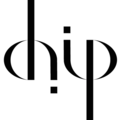



# SRBench Competition 2022: Interpretable Symbolic Regression for Data Science

SRBench hosted its first competition at the [GECCO 2022](https://gecco-2022.sigevo.org/) conference in Boston, MA. 
This competition seeks to distill algorithmic design choices and improve the practice of symbolic regression by evaluating the submitted symbolic regression methods on previously unseen, real-world and synthetic datasets. 
These datasets will be sourced mainly from the domains of physics, epidemiology and bioinformatics.

Participants were asked to adapt and submit their symbolic regression algorithms to SRBench following the [Competition Guide](/srbench/competition-guide/).
These methods were automatically tested for conformance with the competition.
Winners of the *synthetic* and *real-world* track are each entitled to a $1,250 cash prize.  

# Results

In total, there were 13 official competitors. 
After the filtering stage, 9 went on to compete in the synthetic and real-world tracks. 

- **1st Place, Synthetic Track: [QLattice](https://docs.abzu.ai/)**
    - submitted by Meera Vieira Machado & Miquel Triana Iglesias on behalf of Abzu AI

- **1st Place, Real-world Track: [uDSR](https://github.com/brendenpetersen/deep-symbolic-optimization)**
    - submitted by Brenden Petersen,  Mikel Landajuela, Chak Lee, Jiachen Yang, Ruben Glatt, Ignacio Aravena Solis, Claudio Santiago, Nathan Mundhenk

## Synthetic Track Rankings

In the synthetic track, methods were compared according to five properties: 1) re-discovery of exact expressions; 2) feature selection; 3) resistance to local optima; 4) extrapolation; and 5) sensitivity to noise. 

|    | Algorithm     |   Overall Score |
|---:|:--------------|--------------:|
|  **1** | **QLattice**      |          6.23 |
|  2 | pysr          |          5.26 |
|  3 | uDSR          |          4.67 |
|  4 | operon        |          4.38 |
|  5 | Bingo         |          4.32 |
|  6 | E2ET          |          2.74 |
|  7 | geneticengine |          2.54 |
|  8 | eql           |          1.33 |
|  9 | PS-Tree       |          0.85 |

## Real-world Track Rankings

In the real-world track, competitor methods were trained to build interpretable predictive models for 14-day forecast counts of COVID-19 cases, hospitalizations, and deaths in New York State. 
These models were reviewed by a subject expert and assigned ``trust ratings", in addition to being evaluted for accuracy and simplicity. 

|    | Algorithm     |   Overall Score |
|---:|:--------------|--------------:|
|  **1** | **uDSR**          |          5.75 |
|  2 | QLattice      |          5.21 |
|  3 | geneticengine |          4.99 |
|  4 | operon        |          4.8  |
|  5 | Bingo         |          4.66 |
|  6 | pysr          |          4.17 |
|  7 | PS-Tree       |          3.15 |
|  8 | E2ET          |          2.72 |

Congratulations to the winners. 
Please stay tuned for additional updates, as we aim to make these results reproducible by providing all source code. 
The current raw results files can be found at the link below. 

## Organizers

Please address questions to william dot lacava at childrens dot harvard dot edu. 

- Michael Kommenda
    - University of Applied Sciences Upper Austria
- William La Cava
    - Boston Children’s Hospital and Harvard Medical School
- Maimuna Majumder
    - Boston Children’s Hospital and Harvard Medical School
- Fabricio Olivetti de França
    - Federal University of ABC
- Marco Virgolin
    - Centrum Wiskunde & Informatica

# Sponsors

 

