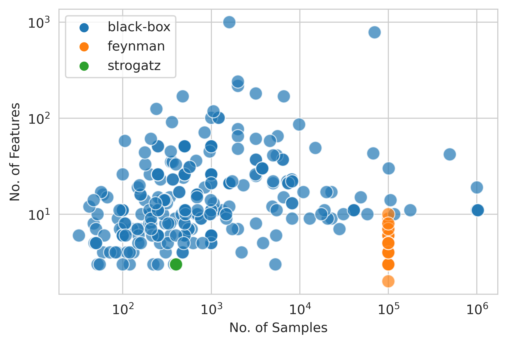
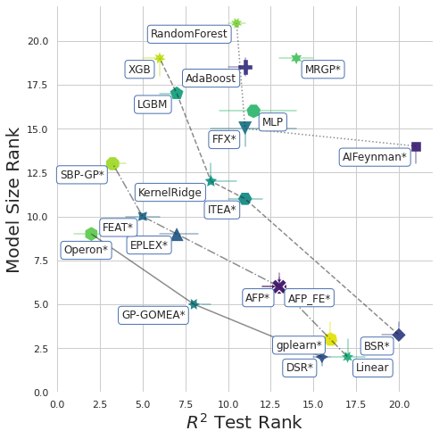
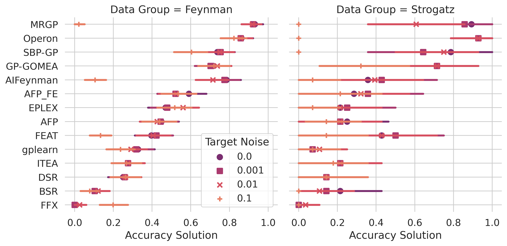

# Benchmarking Results

This page summarizes the results of the postprocessing notebooks found in this folder. 

Results are summarized over datasets. 

## Problems

We analyze two types of problems:

**Black-box Regression Problems**: problems for which the ground-truth model is not known/ not sought. 
Includes a mix of real-world and synthetic datasets from [PMLB](https://epistasislab.github.io/pmlb'). 
122 total. 

**Ground-truth Regression Problems**: problems for which the ground-truth model known. 
Includes datasets from the [Feynman Symbolic Regression Database](https://space.mit.edu/home/tegmark/aifeynman.html) and dynamical systems from the [ODE-Strogatz Database](https://lacava.github.io/ode-strogatz/). 
130 total. 

# Results for Black-box Regression

.png)

## Accuracy-Complexity Trade-offs

Considering the accuracy and simplicity of models simultaneously, this figure illustrates the trade-offs made by each method. 
Methods lower and to the left produce models with better trade-offs between accuracy and simplicity. 

# Results for Ground-truth Problems

## Symbolically-verfied Solutions

How often a method finds a model symbolically equivalent to the ground-truth process

-by-Algorithm_Data-Group.png)

## Accuracy Solutions

How often a method finds a model with test set R2>0.999

